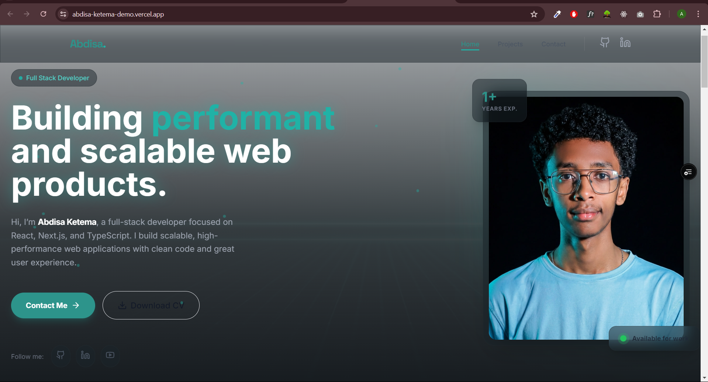
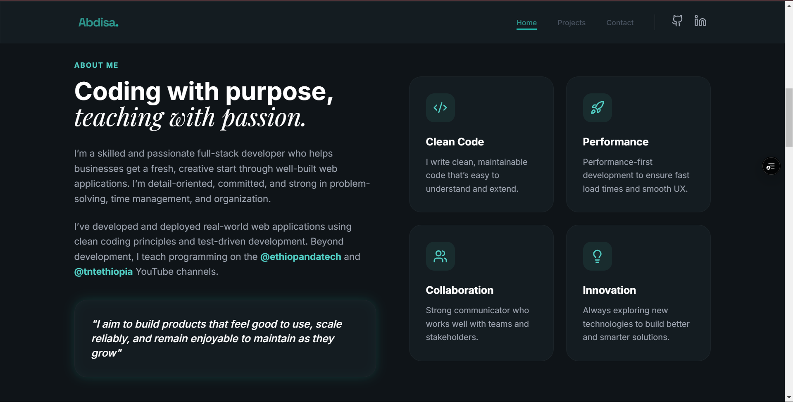
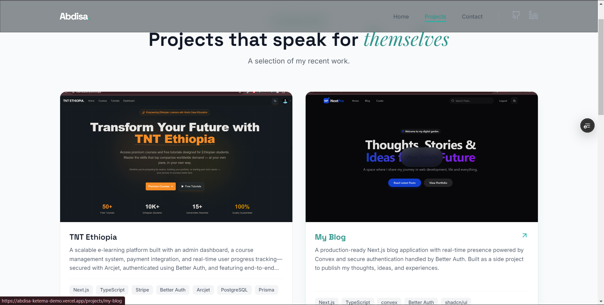
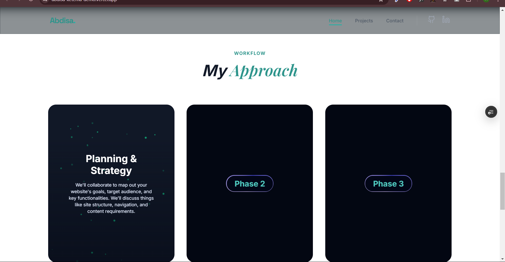

# 🌐 Abdisa Ketema - Full Stack Developer Portfolio

A premium, high-performance portfolio website built with **Nuxt 4**, **Tailwind CSS**, and **TypeScript**. This project features a modern glassmorphism design, smooth animations, and a production-ready architecture.

🚀 **[Live Demo](https://abdisa-ketema-demo.vercel.app/)**

---

## ✨ Features

- **🎯 Modern Design**: Premium glassmorphism aesthetic with tailored color palettes and "Space Grotesk" & "Inter" typography.
- **⚡ High Performance**: Optimized image loading, lazy-loading components, and minimal bundle size powered by Nuxt 4.
- **🎨 Advanced Animations**:
  - Dynamic particles in the Approach section using Canvas API.
  - Interactive SVG-dash animated buttons.
  - Smooth scroll-triggered entrance animations using `@vueuse/motion`.
  - Floating background blobs and marquee skill sliders.
- **📱 Fully Responsive**: Seamless experience across mobile, tablet, and desktop devices.
- **🛠️ Dynamic Content**:
  - Project gallery with dynamic routing (`/projects/[id]`).
  - Centralized data management via Nuxt composables.
  - Fully functional contact form interface.

---

## 🛠️ Tech Stack

- **Framework**: [Nuxt 4](https://nuxt.com/) (Vue 3, Vite)
- **Styling**: [Tailwind CSS](https://tailwindcss.com/)
- **Icons**: [@nuxt/icon](https://nuxt.com/modules/icon) (Lucide Icons)
- **Animations**: [@vueuse/motion](https://motion.vueuse.org/)
- **Type Safety**: TypeScript
- **Deployment**: Vercel

---

## 📸 Screenshots

|          Hero Section           |             About Me              |
| :-----------------------------: | :-------------------------------: |
|  |  |

|                Projects                 |               My Approach               |
| :-------------------------------------: | :-------------------------------------: |
|  |  |

---

## 🚀 Getting Started

### Prerequisites

- Node.js (v18.0.0 or higher)
- npm / pnpm / yarn

### Installation

1. **Clone the repository**

   ```bash
   git clone https://github.com/devabdisa/portfolio-nuxt.git
   cd portfolio-nuxt
   ```

2. **Install dependencies**

   ```bash
   npm install
   ```

3. **Run development server**

   ```bash
   npm run dev
   ```

4. **Build for production**
   ```bash
   npm run build
   ```

---

## 📂 Project Structure

```text
├── app/
│   ├── assets/          # Global CSS and themes
│   ├── components/      # Reusable Vue components (Navbar, Footer, ApproachCard...)
│   ├── composables/     # Shared logic (useProjects...)
│   ├── layouts/         # Default page layouts
│   └── pages/           # Application views (Index, Projects, Contact...)
├── public/              # Static assets (images, profile photo, project thumbnails)
├── screenshots/         # Portfolio previews for README
├── nuxt.config.ts       # Nuxt configuration
└── tailwind.config.ts   # Custom Tailwind theme and animations
```

---

## 🤝 Contact & Credits

- **Developer**: Abdisa Ketema
- **GitHub**: [@devabdisa](https://github.com/devabdisa)
- **LinkedIn**: [Abdisa Ketema](https://www.linkedin.com/in/abdisa-ketema/)
- **YouTube**: [Ethio Panda Tech](https://www.youtube.com/@ethiopandatech)

Made with ❤️ by Abdisa Ketema
